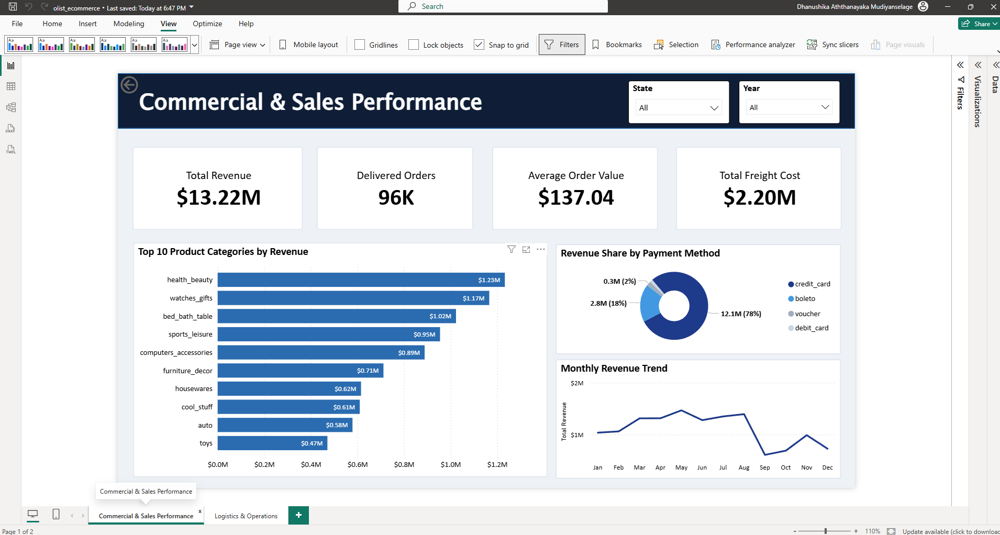
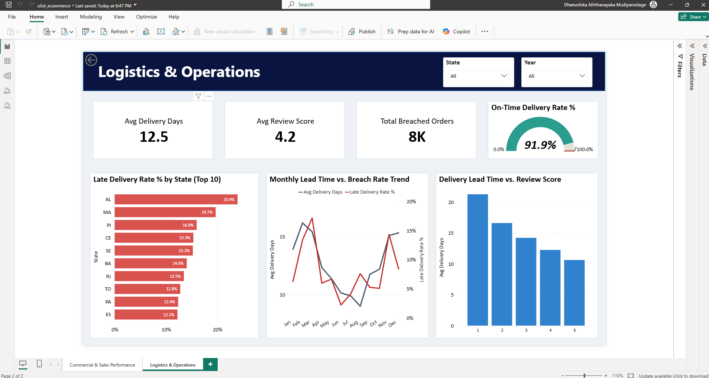
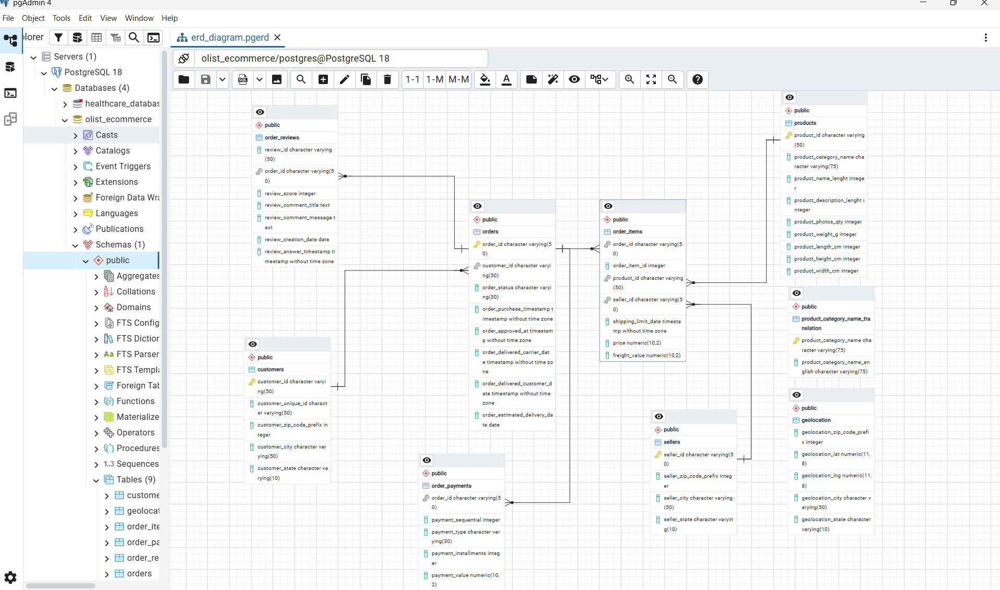

# 📦 Brazilian E-Commerce: Commercial Performance & Logistics Analytics

An end-to-end business intelligence solution analyzing **96,000+ customer orders** from the Brazilian e-commerce platform **Olist**. The project couples an exploratory PostgreSQL relational database backend with an executive-level, two-page Power BI dashboard evaluating commercial sales drivers, fulfillment bottlenecks, and delivery Service Level Agreement (SLA) breach rates.

---

## 📊 Executive Dashboard Previews

### Page 1: Commercial & Sales Performance

### Page 2: Logistics & Operations

---

## 📁 Dataset

* **Source:** [Brazilian E-Commerce Public Dataset by Olist on Kaggle](https://www.kaggle.com/datasets/olistbr/brazilian-ecommerce)
* **Scope:** ~100k orders (2016–2018) covering orders, payments, shipping, customer locations, and reviews.

---

## 📌 Executive Summary & Key KPIs

* **Total Sales (GMV):** **$13.22M** in net revenue locked strictly to completed orders (`order_status = 'delivered'`).
* **Delivered Orders Volume:** **96K** fulfilled customer orders.
* **Average Order Value (AOV):** **$137.04**.
* **Total Freight Costs:** **$2.20M** spent across fulfillment networks.
* **Average Delivery Lead Time:** **12.5 Days** from purchase to doorstep delivery.
* **On-Time Delivery Rate:** **91.9%** (with an **8.1%** delay rate across ~8K delayed shipments).

---

## 🔍 Analytical Insights

1. **Logistics Impact on Customer Satisfaction (Review Scores):**
   * Orders receiving **1-star reviews** suffered an average lead time of **~21 days**.
   * Orders receiving **5-star reviews** maintained a lead time of **~10 days**.
2. **Payment Dynamics:**
   * **Credit cards** drive **78%** ($12.1M) of total transaction value.
   * **Boleto** represents the second largest payment method at **18%** ($2.8M).
3. **Category Concentration:**
   * Top revenue generators are led by `health_beauty` ($1.23M), `watches_gifts` ($1.17M), and `bed_bath_table` ($1.02M).
4. **Regional SLA Vulnerability:**
   * Northern and northeastern states face severe fulfillment delays: **Alagoas (AL) leads with a 23.9% breach rate**, followed by **Maranhão (MA) at 19.7%**.

---

## 🗄️ Relational Architecture & ER Diagram

The database is built on a Star Schema optimizing analytical performance and preserving dimensional integrity between facts and dimensions:

* **Fact Tables:** `orders`, `order_items`
* **Dimension Tables:** `customers`, `order_payments`, `order_reviews`, `products`
* **Translation Abstraction View:** Built a unified database view (`vw_products`) joining category translation mapping to normalize Portuguese product classifications into English.

---

## 💾 SQL Querying & Exploratory Analysis

The PostgreSQL pipeline is split into two organized scripts:

1. **[`sql/01_schema_setup.sql`](sql/01_schema_setup.sql):** Contains the Data Definition Language (DDL) defining primary keys, foreign key constraints, and relational integrity.
2. **[`sql/02_business_analysis.sql`](sql/02_business_analysis.sql):** Addresses targeted commercial and fulfillment business questions:
   * Fulfillment state distributions and customer counts.
   * Lead time distributions and delivery duration averages.
   * Shipping cost thresholds (`freight_value > price`).
   * Overdue delivery severity (average and maximum days delayed).

---

## 🛠️ Tools & Technologies

* **Database & Querying:** PostgreSQL, pgAdmin 4
* **Business Intelligence & Reporting:** Microsoft Power BI Desktop
* **Data Transformation:** Power Query
* **Calculations & Data Modeling:** DAX (Data Analysis Expressions), Star Schema

---

## 👤 Author

* **Dhanushika Madushani**[cite: 1, 3]
* **LinkedIn:** [linkedin.com/in/dhanushika-m](https://www.linkedin.com/in/dhanushika-m)[cite: 1, 3]
